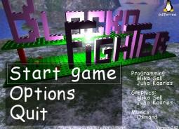
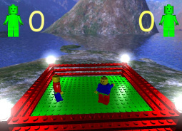
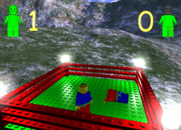

BlockoFighter
=============

A 3D two-player arena combat game, featuring characters similar to a popular construction toy.

About
-----

BlockoFighter is a humorous beat-em-up game which originally started as a school project during a course in computer graphics. The first version called LegoFighter was finished under Christmas 2001 and now, after many months of work and idle time, we are finally presenting BlockoFighter - the second version of the game.

The game has been completely rewritten and there are many improvements which include sound effects and music, a full 3D arena and a nice physics engine. The backbones for the game are OpenGL and SDL.

This version of the game was made as an entry for the game development competition at the Assembly 2002 demo party. It placed third (kudos to the winner, Stair Dismount ;)

Blockofighter is a two-player game where two Blocko men (they may look like LEGO characters but they are not) encounter in a fierce battle which occurs in a rectangular arena located in the spectacular fjords of scenic Lapland. The fighting is so intense that severed limbs or heads are not a rare sight. Furious breakdancing moves are available for skilled players who want to fight with style. West side!

How to play
-----------

Use arrows, enter and esc to navigate in menus.

| Action         | Player 1      | Player 2     |
|:---------------|:-------------:|:------------:|
| Move forward   | Up arrow      | E            |
| Move backward  | Down arrow    | D            |
| Turn left      | Left arrow    | S            |
| Turn right     | Right arrow   | F            |
| Jump           | ¨ or ]        | Q            |
| Hit            | ' or \        | A            |

Requirements
------------

Minimal system requirements are:

* Windows or GNU/Linux operating system
* OpenGL 2.0 (or better) compatible graphics card, with at least 64MB graphical memory
* At least 1GHz CPU
* At least 512MB RAM

Software dependencies are:

* [SDL 1.2](http://www.libsdl.org/)
* [SDL_Image 1.2](http://www.libsdl.org/)
* [FMOD](http://www.fmod.org)

Compiling
---------

Use the provided Makefile (altering it if necessary), and build the game using the `make` command. You can then run the program using the compiled executable, from the main project directory.

Credits
-------

* Miika Sell - Original source code
* Juha Kaarlas - Original source code
* [Michaël Lemaire](http://thunderk.net) - Current maintainer
* Osmand - Music
* Forge - Sound effects

Links
-----

The project is hosted on [GitHub](https://github.com/thunderk/blockofighter).

The original demoscene release is presented on [pouët.net](http://www.pouet.net/prod.php?which=7195).

License
-------

This source code is available under the terms of the [Mozilla Public License](http://www.mozilla.org/MPL/2.0/). Read the full license terms in the LICENSE file.

LEGO® is a trademark of the LEGO Group of companies which does not sponsor, authorize or endorse this program. Any resemblance with LEGO® bricks is purely coincidental or made as a tribute, with no commercial claim whatsoever.
